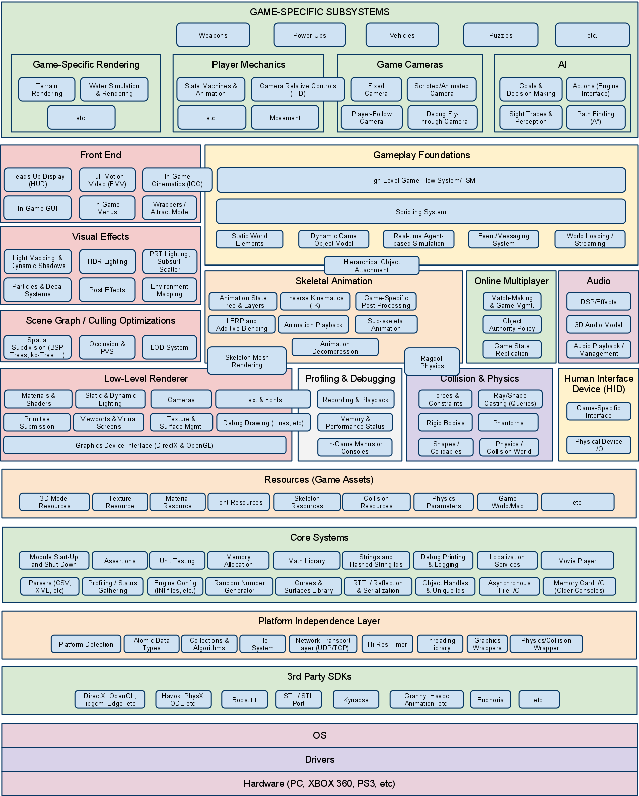
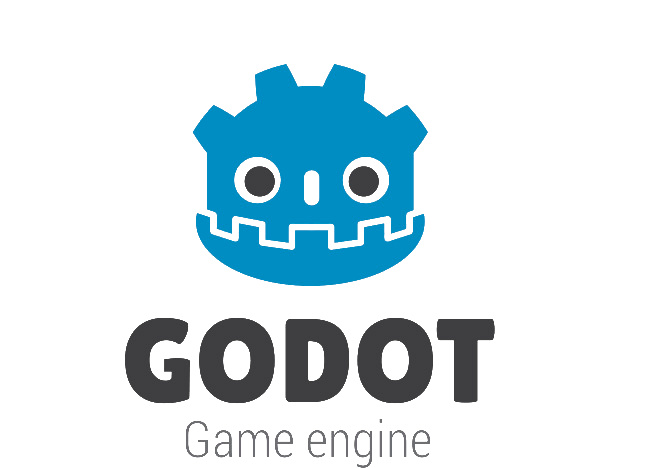
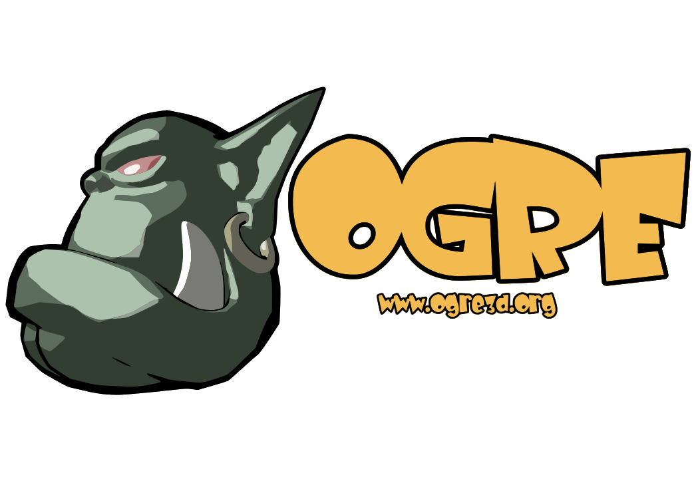
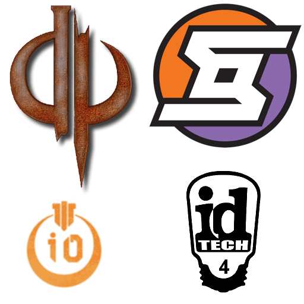

.. Text content is Copyright Ferdinand Majerech 2015 and
.. distributed under the Creative Commons Attribution 3.0 Unported License.
..    (see the license at http://creativecommons.org/licenses/by/3.0/)
..
.. All logos, images and videos used in these slides are property of their respective
.. owners.

============
Game engines
============

----
Why?
----

* It's been done before

  - no need to write basic physics code over and over again
* Concentrate on gameplay instead of tech

  - Focus on engine may derail the game itself

.. * With specific gameplay requirements an engine may be limiting

..   - But this is becoming rare

* Writing a high-end engine is like writing a (not that) small OS

  .. image:: ue4loc.png
     :align: center

  - Expect to rewrite stdlib/OS level stuff because it's *too slow*

------------------------
Game engine architecture
------------------------

.. container:: mainlink

   https://www.youtube.com/user/GameEngineArchitects/videos

   Not the actual topic of this talk (image from [#]_).

.. [#] http://www.gameenginebook.com/

--------------------------
What does a game engine do
--------------------------

* ? Game loop
* ? Graphics, sound
* ? Input
* ? Platform / OS abstraction
* ? Physics
* ? **Map / game editor**
* ? Debugging / profiling
* ? Resources / virtual file system
* ? Networking / multiplayer
* ? Scripting language VM
* ? Entities
* ? ...

--------------------------
Game engines vs 3D engines
--------------------------

3D engines only do graphics; the *game* part is done by the user

3D engines:
 * OGRE
 * Irrlicht
 * three.js

Game engines:
 * CryEngine
 * Unity
 * Unreal Engine 4
 * Godot
 * Construct 2

---------------------------------
Genre specific vs general purpose
---------------------------------

For some genres, good engines already exist; may turn gamedev into modding

Genre specific:
 * ID Tech 4, ioquake3, DarkPlaces, Cube 2 (FPS)
 * Spring, OpenRA (RTS)
 * RPG maker, GemRB (RPG)
 * FS2 Open (Space sim)
 * Adventure Game Studio, Wintermute (Adventure)

General purpose:
 * CryEngine (...but FPS)
 * Unity
 * Unreal Engine 4 (...but FPS)

----------------
Platform support
----------------

* PC (Windows/Linux/OSX)
* Console (PS4/XOne/WiiU, PS3/X360)
* Handheld (Vita/3DS)
* Mobile (Android/iOS/BB/WP)
* Web (JS+WebGL)

--------------------
Other considerations
--------------------

* Community, *assets*, **documentation**
* 3D vs 2D (is it easy to make 2D games in $ENGINE?)
* Open source vs proprietary (full control vs features/resources)
* Costs
* Graphics capabilities (*but can you afford art that will use them?*)
* Compatibility with formats (e.g. 3D assets)
* Language support (can $ENGINE be used from a compiled language?)
* Lock-in: can you use any IDE/VCS/OS/debugger/etc. for development?

**Does the engine have / lack some feature essential to your game?**

---------
CryEngine
---------

.. container:: mainlink

   http://cryengine.com/

* Cross-platform, but no mobile
* Games: Star Citizen, Kingdom Come: Deliverance, etc.
* Awesome graphics, if you have the art
* Supposedly does not scale down to indie-scale development
* Cost:
    - $9.90/month per person for the full engine
    - $LOT_OF_MONEY for source access

---------
CryEngine
---------

.. raw:: html

   <video preload="auto" autoplay controls loop poster="cry_logo.png">
      <source src="_static/cryengine.webm" type="video/webm">
   </video>

--------
Source 2
--------

.. container:: mainlink

   https://developer.valvesoftware.com/

The successor of Source, also known as the "Tower of Duct tape"

* Cross-platform
* No real info yet
* Games: DOTA 2-sorta
* Cost:

  - Free
  - The game must be on Steam (can be elsewhere too)
  - I.e. not really free, Valve gets their cut
  - Don't know about source access

--------
Source 2
--------

.. container:: hugecentered

   No games yet

-----
Unity
-----

.. container:: mainlink

   https://unity3d.com/

.. image:: unity_logo.png
   :width: 40%
   :align: right

* Cross-platform
* Engine in C++, user code in C#/JS/etc.
* Games: Pillars of Eternity, Cities: Skylines, KSP, tons and tons
* Huge community, easy to start with
* Marketplace with tons of free/cheap resources
* Bad reputation among gamers

  - Mostly game dev's, not engine's fault
* Cost:

  - Free (full engine, less tools, **lower bug priority**, splash, <$100000k revenue)
  - $75/month per user: Professional
  - $LARGE_SUM: source code access

-----
Unity
-----

.. raw:: html

   <video preload="auto" autoplay controls loop poster="unity_logo.png">
      <source src="_static/unity.webm" type="video/webm">
   </video>

---------------
Unreal Engine 4
---------------

.. container:: mainlink

   https://www.unrealengine.com

* Cross-platform, but no old consoles
* The (C++) source is open (but not Open Source)
* C++ & Blueprint (visual programming)
* Huge community
* Awesome graphics, if you have the art
* And also 'easy' for indies
* Unreal Tournament 4 - a major UE4 'source open' game
* Cost: 5% of gross revenue above $3000/quarter

---------------
Unreal Engine 4
---------------

.. raw:: html

   <video preload="auto" autoplay controls loop poster="unreal_logo.png">
      <source src="_static/unreal.webm" type="video/webm">
   </video>

-----
Godot
-----

.. container:: mainlink

   http://www.godotengine.org/

* Cross-platform (PC platforms, mobile, web, PS3/Vita/3DS but not other consoles)
* Open source (MIT)
* Scripting: GDScript (Python-like), engine: C++
* "Open source Unity alternative", with much smaller community
* Supposedly really good 2D support in editor
* Cost: Duh

-----
Godot
-----

.. raw:: html

   <video preload="auto" autoplay controls loop poster="godot_logo.png">
      <source src="_static/godot.webm" type="video/webm">
   </video>

----
OGRE
----

.. container:: mainlink

   http://ogre3d.org

* **Not a game engine**

  - No editor
  - Need to write the *game* part yourself
* Cross-platform
* Open source (MIT)
* C++
* Largest open source 3D engine community
* Lot of extensions
* Good graphics

----
OGRE
----

.. raw:: html

   <video preload="auto" autoplay controls loop poster="ogre_logo.png">
      <source src="_static/ogre.webm" type="video/webm">
   </video>

-------------------------------
id Tech / Quake and derivatives
-------------------------------

.. container:: mainlink

   http://ioquake3.org/, https://github.com/ioquake/ioq3, http://www.icculus.org/twilight/darkplaces/

* GPL (commercial licence negotiable)
* Good for FPS - and only for FPS (but... UFOAI)

* Quake 1 / DarkPlaces : Xonotic

  - Tower of duct tape turbo
* Quake 2 / QFusion : UFOAI, Warsow
* Quake 3 / ioquake3 : WoP, Unvanquished, ZEQ2-Lite, Urban Terror...

  - Most popular open source FPS engine
* id Tech 4 / iodoom3 : The Dark Mod

-------
id Tech
-------

.. raw:: html

   <video preload="auto" autoplay controls loop poster="idtech_logos.png">
      <source src="_static/idtech.webm" type="video/webm">
   </video>

.. ===========
.. Weird stuff
.. ===========

.. -----------
.. Voxel Quest
.. -----------

-----------------------
TODO next major section
-----------------------

* (XXX) maybe playing around with an editor of $ENGINE?

  - Can we do that in remaining time (30-40 mins?), on Windows/OSX/Linux?

    * UEngine - probably slow setup, Unity - no Linux (yet),
      OGRE - nice but graphics-only, Godot - bit boring ATM

  - Maybe at least playing around with demos of $ENGINE?

* (XXX) maybe just go through installation of $ENGINE?

* (XXX) More detailed info on $ENGINE by its user from gamedev?

* (XXX) Maybe still something about engine architecture?

* (XXX) more ideas?

---------
Resources
---------

* Game engine search engine: http://devmaster.net/devdb/engines
* https://en.wikipedia.org/wiki/List_of_game_engines
* https://en.wikipedia.org/wiki/List_of_game_engine_recreations
* https://www.reddit.com/r/gameengines/ (?)
