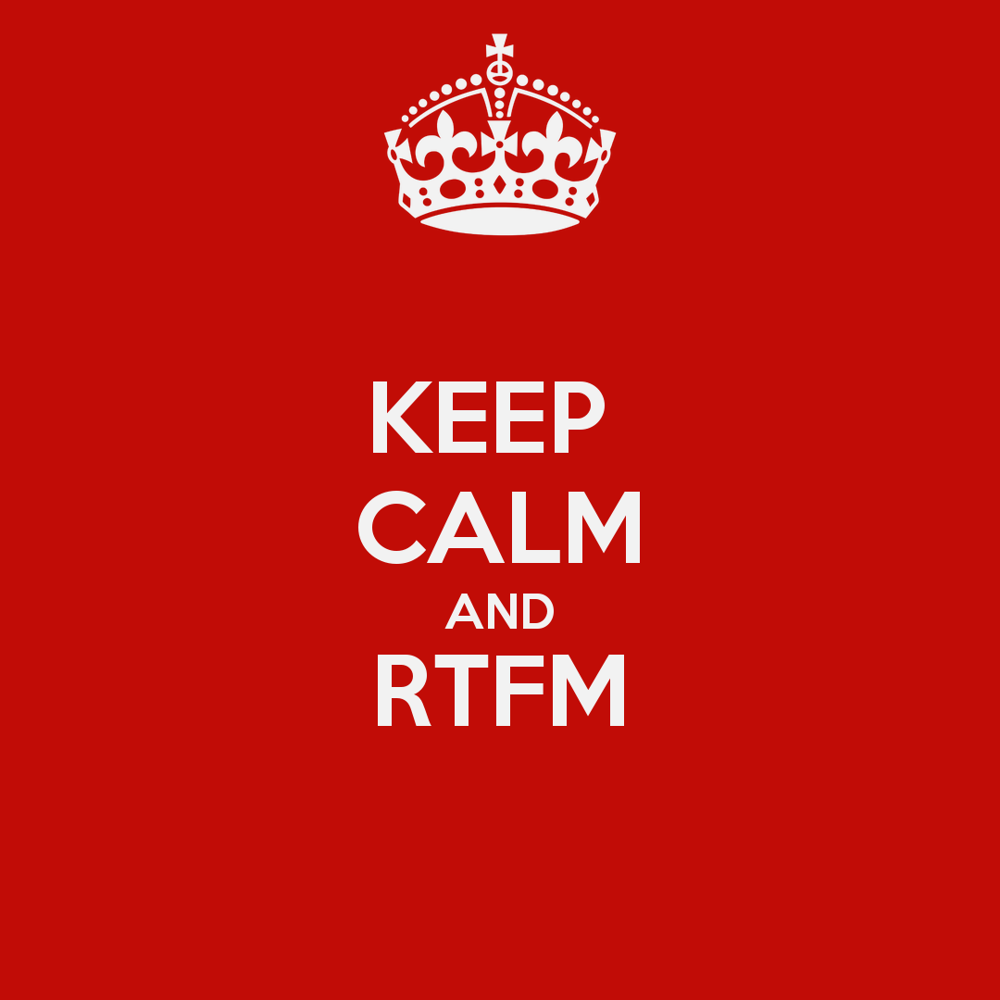

.. Copyright Ferdinand Majerech 2015.
.. Distributed under the Creative Commons Attribution 3.0 Unported License.
..    (see the license at http://creativecommons.org/licenses/by/3.0/)

=========================
Intro to Game Development
=========================

TODO LINK TO WEBSITE ONCE IT EXISTS

.. XXX instead of posting mails, forum.defenestrate.eu/forum.ihra.eu could be used as well.
.. XXX more images, overall fix/improve contents

--------------
Intro to Intro
--------------

* This is a course about game development
* It's high level
* It's not going to teach you how to make games
* It might teach you how to teach yourself to make games

-------------
When in doubt
-------------

#. Google/DuckDuckGo/YaCy/etc.
#. http://reddit.com/r/gamedev daily discussion, http://gamedev.stackexchange.com/,
   http://forums.tigsource.com/, http://ceske-hry.cz
#. Other students
#. http://forum.defenestrate.eu (yes, it's empty, so use it)
#. `kiithsacmp@gmail.com`

--------
Overview
--------

* **Start**

  - Simple game with a simple framework
  - Form teams, come up with game project ideas

* **Core**

  - *Continually* work on those game projects
  - While watching high-level topic talks

* **End**

  - Present your game
  - Interact with real game devs :superscript:`tm`

-----
Start
-----

TODO dates instead of 'till next time/ in two weeks' - based on exact year

* **You are here**: A very simple game using a very simple framework
* **Form teams**:

  - 2-4 people/team
  - **Send team member names** to `kiithsacmp@gmail.com` *till next time*

* **Game idea**:

  - Come up with something **in two weeks** and **send** to `kiithsacmp@gmail.com`

    **Contents**: Basic game mechanics, story (if applicable), language/framework

    The project *may* deviate from this idea over time

----
Core
----

* **Work** on your game, in your team

  - Stand-up meeting every week (stand-up part not mandatory)
  - Use anything as long as legal

    * Make your own engine/language/OS/CPU if you want
    * Or do something not insane
    * Or even use the simple framework presented
* **Topic talks**

  - Order-independent, high-level
  - With links to further resources - use to improve your game

---
End
---

TODO exact dates of 'second-to-last/last/etc.' set depending on year

* **before last-1 talk**:

  Send working game and source to `kiithsacmp@gmail.com`

  - **recommend testing on more than one machine first**

  - The game can be for any platform/s

    More/many platforms will help in evaluation, but is not
    *necessary* for full score, and should not be forced (e.g. PC->mobile)

  - Recommend at least Win7 or Linux (PC) / Android (mobile)

    (- so it can be tested; otherwise may need to show the game working in person)

---
End
---

* **Last talk**: game presentations & **live gameplay**

  - Bring a machine with your game (or install it here)
  - Meet local game devs who will present their teams/projects
  - Present your game with slides in 5 minutes

    * **or** avoid that by creating a *public* video on YouTube/Vimeo/etc

      similar to e.g. https://www.youtube.com/watch?v=EhI-Loe60i4

  - See others play your game; play other's games.

----------
Evaluation
----------

TODO depends on whether the subject is graded;
if not (best case), we can throw this out
and replace with 'make a game => absolvoval'

Mandatory:
  * Presentation or video (**10-20pt**)
  * Your game (**20-75pt**)

    - To guarantee 75pt, be better than the competition:

      http://sccg.sk/~mferko/tdh/?page_id=9

* Work over time ("stand-up" meetings, questions, etc.) (**0-15pt**)
* A new topic with slides/resources [#]_: (**20pt** per topic)
* A minor fix in slides/resources: (**1pt** per fix)
* Enter IHRA [#]_ (**10pt**), send and present your game there (**10pt**)

.. [#] http://github.com/kiith-sa/upjs-gamedev
.. [#] http://web.ics.upjs.sk/ihra

.. TODO http://ihra.sk

-----------------
Evaluation cont'd
-----------------

===== ==========
A     >= 100
B     >= 90
C     >= 80
D     >= 70
E     >= 60
===== ==========

**Alternative ways to get an A**

* Get hired at a gamedev company
* Sell 500 copies of your game
* Win IHRA U category: http://web.ics.upjs.sk/ihra

-----------------
Gamedev in Košice
-----------------

TODO info about meetups, when/where they are

.. TODO ihra.sk

* IHRA:       http://web.ics.upjs.sk/ihra
* GamesFarm:  http://www.games-farm.com/
* Fishcow:    http://www.fishcowstudio.com/
* Perihelion: http://perihelioninteractive.com/

--------------------------------------
Graphics, sounds, engines, communities
--------------------------------------

IHRA -> Zdroje:

http://web.ics.upjs.sk/ihra/pages/resources.html

.. XXX note: LOVE is not definitive though seems to be the best choice ATM

====
LÖVE
====

TODO whole section

.. XXX short description

.. XXX tutorial (win/lin/mac)
.. XXX mention the vm on web/usb fallback
       (XXX prepare that vm and usb stick)

.. XXX Go over making a simple game (based on some web tutorial)
       - maybe even just link to a tutorial, may be more up-to-date;
         but must be tested on all/most platforms

-------
The end
-------

TODO LINK TO WEBSITE ONCE IT EXISTS

* Go make an account at http://gamedev.stackexchange.com/,
  http://forums.tigsource.com/ and/or http://ceske-hry.cz,
  you'll need it
* Go form a team, send info to `kiithsacmp@gmail.com` till next time
* Go write up a game idea, send to `kiithsacmp@gmail.com` till the next next time
* http://web.ics.upjs.sk/ihra/pages/resources.html

