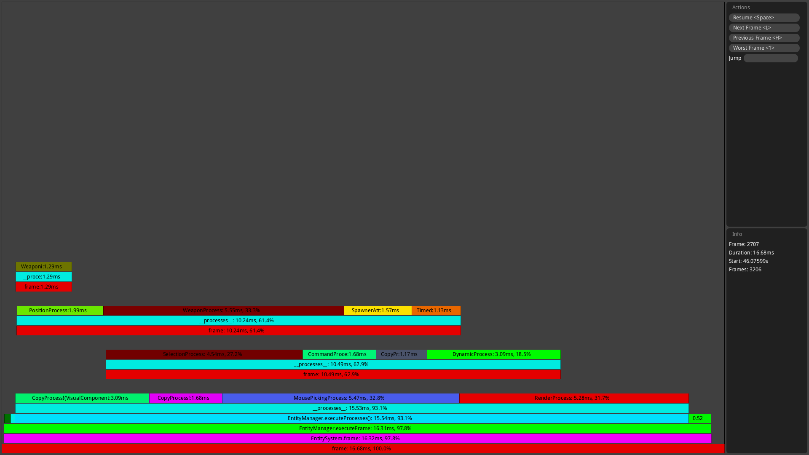
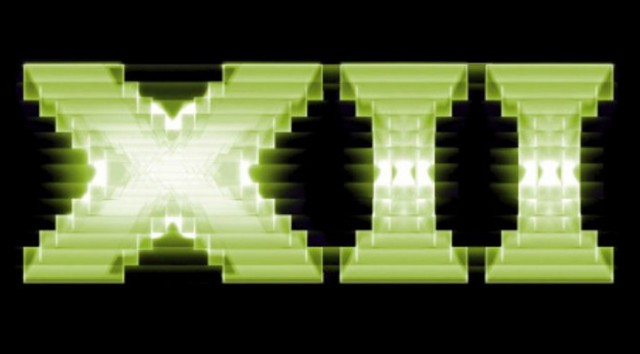

.. Copyright Ferdinand Majerech 2015

.. Distributed under the Creative Commons Attribution 3.0 Unported License.
..    (see the license at http://creativecommons.org/licenses/by/3.0/)

=======================
Games without an engine
=======================

.. XXX link to slides on site

-----
Intro
-----

* Making a game without an engine

  Also known as; **making an engine**

* Engines may differ wildly based on what the game needs

  - 'Small' FPS vs RTS vs open-world RPG vs big procedural spacesim vs ...

-----
Intro
-----

* **YAGNI** rules all; don't add $FEATURE until you know you need it

  - A full-featured engine takes an army of people

* You **will** rework stuff; a lot

* When in doubt, pick the option that can is easier to replace/remove

* Keep the pieces isolated (duh)

  - If you change the graphics API, you shouldn't rewrite game logic

---------------------------------
Overview: OS abstraction/basecode
---------------------------------

* Filesystem/VFS
* User input
* Windowing
* Threading
* High-res clock
* Networking
* ...

----------------
Overview: Output
----------------

* Graphics ?
* Sound ?
* Text/ machine-readable formats?

--------------------
Overview: Game logic
--------------------

* Map/level ?
* Scripting ?
* Entity management ?
* Physics ?
* AI ?

Some combination of 'engine-side' code and 'data' (including any scripts)

.. TODO languages? (C/C++, JS,Java/C#, Python)

---------
Game loop
---------

* Get input
* Update game logic
* Draw/play sounds/send state over network
* Repeat
* **All in milliseconds** (1000ms / FPS); 1000 / 60 ~~ 16.7

* May be more complicated

  E.g. may want to always *update* at 60FPS but only draw if we have time

-----------------------------------------------
Game loop example; fixed FPS + optional drawing
-----------------------------------------------

.. code:: d

   const frameDurationNS = 1000_000_000 / 60.0; // 60-FPS 

   ...

   // milliseconds is not enough; micro/nano are enough
   const prevFrameStartNS = highPrecisionTime();
   while(true)
   {
       const startTimeNS = highPrecisionTime();
       // Multiply speeds with this to get deltas
       // May even use a fixed timeElapsed to simplify multiplayer
       const timeElapsed = (startTimeNS - lastFrameStartNS) / 1000_000_000;
       if(!processInput()) { break; }
       updateGame(timeElapsed);

       const currentTime = highPrecisionTime();
       if(currentTime - startTime < frameDurationNS) { drawGame(timeElapsed); }

       waitUntil(startTimeNS + frameDurationNS);

       prevFrameStartNS = startTimeNS;
   }

**How to improve this?**

.. Note: e.g. keep track of draw time so we can check if we have *enough time to draw* left

-----
Input
-----

* Hide it behind an API for the rest of the game to check for input
* E.g. ``input.playerRunning()`` instead of ``keyboard.isPressed(Key.SHIFT)``.
* Easy to add support for

  - user-configurable keybindings
  - gamepads/touchscreens/motion controls...
  - input recording
  - AI to use player input

-------------------------
Virtual file system (VFS)
-------------------------

* Used in some games (but maybe **YAGNI**); helps moddability
* Map multiple directories to the same directory, with priority

  - E.g. VFS directory ``units``:

    * Maps to ``./game/units``, and ``./mod/units`` with higher priority

    * Now, ``./game/units/tank.cfg`` can be overridden by ``./mod/units/tank.cfg``

      VFS only sees: ``units/tank.cfg``

* Often used by a **resource manager** ... which gets more complicated

  - Loading, caching, unloading (models, textures, sounds, shaders...)

.. TODO something about maps/map editors?

--------------------
Game state - storage
--------------------

* Most state needs to be updated **every frame**

  - Linear, consecutive storage (aka **arrays**)

* Drawing, collision detection need to quickly cull most objects 

  - **Tree** structures (*octree*, *quadtree*, *BSP*, etc.)

* Objects **may** have a natural hierarchy 

  - *Scene graphs*; e.g. apply transform of parent objects to children

* **Multiple** simultaneous structures often work

  - Or different *parts* of game objects in different structures

------------------------------------------
Game state - Entity-Component System (ECS)
------------------------------------------

* Manages (many?) (complex?) **different** entities
* Also takes care of the *linear storage* part (implementation)
* *Components*: store **data** for a single concern

  E.g. visual, health, collision volume

  An entity may or may not have a component of a certain type (except...)

* *Systems*/*Processes*: implement individual pieces of **logic**

  E.g.: ``VisualSystem`` processing entities with
  ``Visual`` **and** ``Position`` components

* *Entity* itself is often just an ID associated with Components

---------
Scripting
---------

* Game logic is often a separate *interpreted* language

  - E.g. Lua, Python are often used 
  - UE4: Blueprint, Unity: C#/JS

* The engine must include the interpreter 
* Easier to change game logic without recompiling 
* C++ knowledge not needed
* Moddability

-------
Physics
-------

* **Affects game logic**, unlike graphics
* Is a huge pain in the ass
* If you need something non-trivial:

  Use a physics engine (``Bullet``, ``Newton Dynamics``, ``Box2D`` ...)

  .. image:: bullet_logo.png
     :width: 25%
     :align: left

  .. image:: newtonLogo.png
     :width: 35%

  .. image:: box2d.png
     :width: 30%
     :align: right

* Physics with simple convex rigid bodies is *manageable*

* If many games (e.g. RTS), axis-aligned bounding boxes suffice

--------
Graphics
--------

* **Graphics programming**; worth a topic/course/program

* Needs to draw GUI - **don't** end up writing an entire framework
* Needs *spatial management* - culling
* May use a scene graph; nested transforms
* May use multiple *render passes* (depth, deferred lighting, postprocessing...)
* And shader/GPU compute programming...
* ...
* Oh, and loading and managing 2D/3D data

-----
Audio
-----

* Sound effects & voice

  Affected by distance/position, level layout, doppler effect
* Music 

  Dynamic? (changing/mixing samples based on situation)

* Can be procedural, just like graphics 

  Google ``procedural music``

* If making a small game, you just need simple sounds & music

  Unless you're making an audio game

--
AI
--

* Needs to 'see' and 'control' the game, just like the player

* Approaches

  - Simple ``do A then B then C`` scripts
  - More advanced ``do A then if X do C``
  - Random decisions with some weights (e.g. the original XCOM)
  - Decision trees
  - Expert systems (rare)
  - Genetic algorithms (e.g. unit composition in an RTS)
  - Neural networks (e.g. *fight or flight* of a group)

* Topic of its own

------------------------
Multiplayer over network
------------------------

* Topic of its own

* Collect input from & send game changes to clients

  - Only accept 'possible' input; prevent cheating

* There **will** be delays much longer than a frame 

  Latency now bigger issue than bandwidth

* Clients need to compensate for delays/packet loss

  Client side *prediction*, then *correction* from server data

* Alternatively, synchronous multiplayer + perfect determinism

  "Easy" but syncing, scaling, bugs are a bitch

============================
Predictability > performance
============================

----------------------------
Predictability > performance
----------------------------

.. XXX SVGs for these 2 cases?

We always need to fit in that frame time (e.g. 16ms)

* If we take 100ms instead, the user will see lag

* If we take 25ms every other frame, user's head may hurt

-----------------------------------------------
Predictability > performance: memory allocation
-----------------------------------------------

* GC ``new``/equivalent is really fast

  - Until the GC pauses your code (happens even with the best)

* RC/RAII have more overhead, but are *predictable*

  - Alloc on construction, free when out of scope/references
  - No unexpected lags, even if a few % slower

* ``malloc``/equivalent can take arbitrary amounts of time

  - Solution: preallocate a big chunk of memory

    Build an allocator on top of that

-------------------------------------
Predictability > performance: threads
-------------------------------------

* Creating a thread (usually) takes a long time
* Java-style threading usually not an option
* Create threads at startup, reuse them over time

* Thread ``sleep()``/``yield()`` may take more time than you expect

  - But if you don't tell the OS to, it **will** pause it when you need it least
  - Trial & error

* Many mutex locks per frame may take too long

  Design to minimize locking

---------------------------------
Predictability > performance: I/O
---------------------------------

* Latency between the keyboard/gamepad and the game

  Don't delay that input further if you can avoid it

* File I/O, even to stdout, is killer 

  Especially when done multiple times per frame 

* Try to read/write files asynchronously or in background threads

* Do any loading outside of a game loop 'frame'

  multi-second frames may throw off game logic

* If you work on an SSD, don't forget to **test with a HDD**

---------------------------------------------
Predictability > performance: profiling games
---------------------------------------------

* Conventional profiling profiles performance only 

  - Rare lags get averaged out

* Frame profiling: 

  http://defenestrate.eu/2014/09/05/frame_based_game_profiling.html

  - Keep track of overhead in each individual frame
  - Lag easy to detect, will prolong the entire frame
  - RAD Telemetry 
  - Despiker

* Profiling on Linux slides:

  http://defenestrate.eu/_static/profiling-slides/index.html

---------------------
Shameless Despiker ad
---------------------

https://github.com/kiith-sa/despiker

-----------------------------------------------
Jeff Dean: Numbers every programmer should know
-----------------------------------------------

==================================== =============== =================
L1 cache hit (data not in register)  ~0.5 ns         few cycles
Branch mispredict                    ~5 ns
Lmax cache reference (L1/L2 miss)    ~7 ns           ~14x L1 hit
Mutex lock/unlock                    ~25 ns
Main memory reference (Lmax miss)    ~100 ns         ~14x L2 hit
Compress 1K bytes w/ Snappy (Google) ~3,000 ns
Send 2K bytes over 1 Gbps network    ~20,000 ns
Read 4k random read from SSD         ~150,000 ns
Read 1 MB sequentially from RAM      ~250,000 ns
Round trip within same datacenter    ~500,000 ns
Read 1 MB sequentially from SSD      ~1,000,000 ns
Disk seek                            ~10,000,000 ns
Read 1 MB sequentially from disk     ~20,000,000 ns  ~80x RAM + seek
Send packet CA->Netherlands->CA      ~150,000,000 ns
==================================== =============== =================

========
Basecode
========

--------
Basecode
--------

* Using the OS directly is a stupid idea

  - People've done this stuff
  - Unless you can handle all OS's directly by yourself

* Basecode libs exist:

  - **SDL2**
  - SFML
  - ClanLib
  - Allegro
  - Etc.

---------------
Basecode - SDL2
---------------

Supports pretty much every platform/OS (e.g: SH4/Dreamcast)

.. image:: SDL_logo.png
   :width: 25%
   :align: right

* Basic windowing (needed for e.g. OpenGL)
* 2D rendering API; software & OpenGL backends
* Input (keyboard, gamepad, touchscreen, motion control ...)
* Various abstracted OS functionality
* Threads/synchronication (C++11/C11 now have those too)
* C API & bindings for a ton of languages
* Supported and developed by **Valve** (Sam Lantinga)

----------------------------
Basecode - SDL2 - extensions
----------------------------

* ``SDL-ttf``: fonts
* ``SDL-image``: image format support
* ``SDL-mixer``: audio
* ``SDL-sound``: audio format support
* ``SDL-net``: networking

* ... many others

* Also, ``Assimp`` is good for 3D formats

------------------
Basecode - 3D APIs
------------------

Got a lot more complicated recently...

* Old gen:

  - **D3D** <= 11: Windows, WinPhone, XBox
  - **OpenGL**: All PC, some consoles

* New gen:

  - **Mantle**: started the wave; now dead (AMD only)
  - **D3D12**: Win10, WinPhone, XBox One
  - **Vulkan**: everything except... kinda a lot (Apple, WP, consoles)
  - **Metal**: iOS, OSX (kinda)

* Kinda stuck with:

  - **OpenGL ES**: Mobile, some consoles, PC
  - **WebGL**: All web platforms

---------------------------
OpenGL vs D3D API evolution
---------------------------

* **D3D**: reinvent/break everything every release
* **OpenGL**: never break compatibility, even if announced

  Kinda like Java

* **OpenGL ES**: somewhat cleaner OpenGL; *did* break compatibility

--------------------------
*Old* vs new graphics APIs
--------------------------

* "High-level" (think Java)
* Huge amount of driver code

  - Compiler, linker...
  - Tell the driver to draw X; it will do it ... *eventually*

    * After checking a ton of internal state, batching, etc.
  - Tries to guess what you're doing, 'solve the hard problems'
* In case of OpenGL, tons of historic cruft (think Java...)
* 'Easier' programming; driver bugs, extremely hard to debug

--------------------------
Old vs *new* graphics APIs
--------------------------

* "Low-level" (think C)
* Extremely thin driver

  - Direct control
  - Generate command buffers to send to GPU queues
  - Need to manually check what the driver would check

    * But not on every single draw
  - Nothing ever done behind the user's back

* 'Harder' to program but does exactly as told

----------
Conclusion
----------

* **YAGNI**
* A game engine consists of lots of stuff
* Watch your latency/lags
* Don't try to reinvent everything, libs exist

-------
The end
-------
