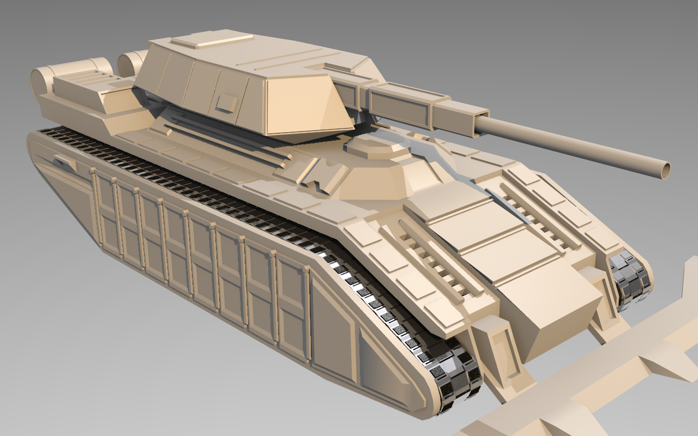
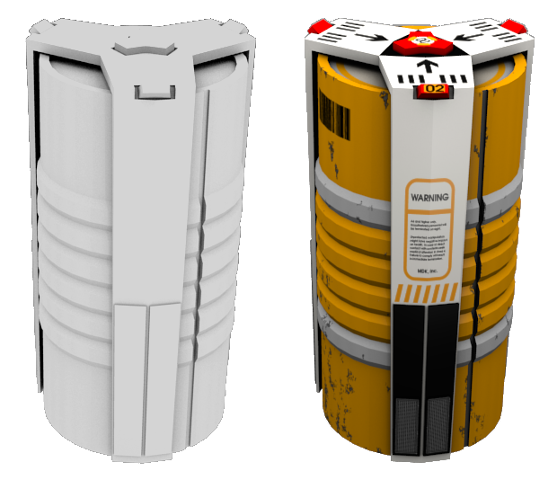

.. Copyright Ferdinand Majerech 2015
.. Distributed under the Creative Commons Attribution 3.0 Unported License.
..    (see the license at http://creativecommons.org/licenses/by/3.0/)

==============================
Making (3D) graphics for games
==============================

.. TODO link to slides on site

---------------------------------------
All kinds of graphics assets/approaches
---------------------------------------

* Triangle meshes 
* Voxels

* Textured?
* Shaders?
* Animated?
* Procedural?
* ...

======================
Triangle mesh graphics
======================

--------------------
Blender - setting up
--------------------

* Get it (or use your own tool)

  https://blender.org/download

  On Linux also: ``sudo apt-get install blender`` or equivalent

* **This is not a complete Blender tutorial**

* Other tools include:

  - Autodesk Maya/3DSMax, Cinema4D
  - More specific tools, like Modo, ZBrush, Wings3D

----
Cube
----

.. original content

----
Cube
----

* This is Cube.
* It has 6 faces - quads.

  - Actually, there is **no such thing as a quad; or a polygon**
  - The GPU only knows triangles
  - .. image:: triangulation.png
       :align: right
       :width: 46%

    Quads/polys are easy to work with;

    on export we need to *triangulate*

  - Ensure quads/polys are **flat** & **convex**

      - weird stuff may and will happen otherwise

.. public domain

----------------------
Basic Blender controls
----------------------

* If you played around with Blender till now, restart it.

* ``<Tab>``: switch between *object*/*edit* **modes**

  Switch to edit mode; will edit the selected object (cube)

* ``drag-<MMB>``: rotate the view, ``<Wheel>``: zoom

* ``<RMB>``: **select** (a vertex) + ``<Shift>-<RMB>`` to select more

* ``A``: select/deselect **all**  

* ``B``, then ``drag <LMB>``: select in rectangle; **adds** to selection

.. container:: centered-bottom

   Next slide with GIF

----------------------
Basic Blender controls
----------------------

----------------------
Basic Blender controls
----------------------

* ``G``/``R``/``S``: **grab**, **rotate** and **scale** 

  Use these in the **edit** mode unless you know what you're doing
* ``Gx``/``Gy``/``Gz``: grab in the **x**/**y**/**z** direction 

  Analogous for ``Rx``/``Ry``/``Rz``, ``Sx``/``Sy``/``Sz``
* ``Gx-1.5``: grab around x by **-1.5** units 

  Analogous for ``G``/``R``/``S`` in all directions

Go play around grabbining, rotating and scaling stuff now - in **edit** mode.

.. container:: centered-bottom

   GIF on next slide

----------------------
Basic Blender controls
----------------------

-------------------------
Triangles and performance
-------------------------

.. * <=65534 vertices => 16bit indices may be used

* More triangles, vertices *on scene* => less performance

  - Mobile: n * 100k
  - Console: n * 1M
  - PC: HD2000 or Titan X?

FPS; few players? lots of tris/model

RTS; 1000 units/screen? fewer tris/model

**Many other factors** (shaders, textures...)

----------------------------------
Keep the triangle/vertex count low
----------------------------------

- Details that affect silhouette matter

  Other details can be handled by textures

- Don't model what you don't see in game
- Rarely seen/distant/uninteresting parts need less detail

  - Unreachable areas (e.g bottom of a vehicle)
  - Body vs face on a character

  This also applies to texturing

----------
Silhouette
----------

--------------------
Subdivision modeling
--------------------

* Subdivide 
* Extrude 
* Grab/scale 
* Repeat
* 2 days/weeks/months later:

--------------------
Subdivision modeling
--------------------

* Enable ``face select``
* Select a face of the cube 
* Press ``W`` and select `Subdivide`

  - Note the options on the left panel, like ``Number of cuts``
* Increase ``Number of cuts`` (right panel) to ``2``
* Select some of the resulting faces
* Press ``E`` and drag your mouse around to extrude
* Yay 

.. container:: centered-bottom

   GIF next slide

--------------------
Subdivision modeling
--------------------

-------------------------
More subdivision modeling
-------------------------

* Can also ``line select`` opposing lines on a face and subdivide 

* Can also `E1.5` to extrude by 1.5 units 

* Grab (``G``) + scale (``S``) to get more freedom

.. container:: centered-bottom

   GIF yada yada

-------------------------
More subdivision modeling
-------------------------

-------------------------
Art style vs model detail
-------------------------

-------------------------
Art style vs model detail
-------------------------

* Realism is nice *if you can afford it*
* Detailed art is *expensive*
* *Low*-detail realism **looks like shit**

* Good-looking art is not always expensive

  Cheap art is not always bad
* **Keep the art consistent**

* This is worth a topic by itself

-------------------------
Art style vs model detail
-------------------------

---------
Texturing
---------

.. Original content

----------
UV mapping
----------

* Mapping 3D coordinates to a 2D surface
* *unwrapping* like a paper model in reverse
* High detail areas => big on the UV map

  And vice versa

.. .. TODO? UV map + render example of the above
..              (from my own models)

* Areas can *overlap* on the UV map to reuse the texture

.. .. TODO? UV map + render example of the above
..              (from my own models)

* Built-in in 3D packages 

  - Stand-alone UV mapping tools exist, but not much better

---------------------
UV mapping in Blender
---------------------

* ``<Ctrl>-<Left>`` x5 to move to the UV edit work space
* Line select
* Select lines where you want to "cut the paper model"
* ``<Ctrl>-E`` => ``Mark Seam``
* ``A`` to select the entire model and ``U`` => ``Unwrap``
* Not you an select and ``G``/``R``/``S`` stuff in the UV window

.. container:: centered-bottom

   yada GIF yada

---------------------
UV mapping in Blender
---------------------

--------
Textures
--------

* Are (usually) 2D raster images
* Use **lossless** power-of-two textures (not just in Blender)

  - 512x512, 4096x128, etc.

* Use 2D editors: KRita, Adobe PS, GIMP...
* Or procedural texture generators 

  - Builtin in almost every 3D package (including Blender)
  - Also stand-alone: google *Procedural texture generator*

------------------------
Basic texture in blender
------------------------

* In UV editor, click ``Image`` -> ``New Image`` and for generated type select ``Color grid``
* In 3D view, enable ``Textured`` viewport shading to see a textured model
* **Note**; the texture *is not* actually applied to the model yet 

  That involves *materials* (google if interested)

* You can paint the texture from 3D view in ``Texture paint`` mode 

  - Or as a 2D image with an external tool
  - Or both! google ``Blender Project Paint``:

    * Take screenshot, draw on it in 2D program, apply changes in Blender

.. container:: centered-bottom

   yada yada yada GIF

------------------------
Basic texture in blender
------------------------

-------------
Data textures
-------------

* Textures can store any data that varies over the surface of a model

* *diffuse* color, surface normals, specular, glow, light/AO, height/offset ...

  - Even data affecting game logic

-----------
Normal maps
-----------

* Normals determine how light is reflected
* On a 3D model, normals are **per-vertex**
* Normals are 3-component vectors... 

  - **RGB** is a 3-component vector too

* A normal texture/map can add 'fake details'

  .. image:: normal1.png
     :width: 65%

* More advanced; with heights: Parallax, offset, relief, **displacement** mapping

* Learn it yourself if interested

.. * yada yada yada GIF
.. .. TODO? GIF
.. .. TODO? play around with normals in Blender (by drawing)

------
Baking
------

* Create a high and low detail model
* Render normals of the high detail model to texture

  - Use as normal map for the low detail model

* Other data can also be baked:

  - Diffuse/specular from procedural materials
  - Ambient occlusion
  - Height 
  - ...

* Find out more: **use Google**

------------------------
Textures and performance
------------------------

* Filling VRAM is bad, filling RAM is **murder**
* Textures uncompressed or fixed-ratio compressed in VRAM
* 4B diffuse + 4B normal/height + 3B specular + 1B glow == **12B / pixel**

  - also there may be more data, **32-bit** float components, etc.
* 2048x2048 - 4M pixels, x12 per pixel: 48MiB VRAM for a **single texture**

  - \* 4/3 with mipmaps
  - /2, /4 or /8 if lucky with compression (S3TC, ETC, ASTC, etc.)
  - Consider lower resolution for some data
* Oh, and models, framebuffers need to fit into VRAM too

------------------------
Textures and performance
------------------------

* Memory is not the only limit
* How many texels can the GPU handle per frame?
* How much time do **shaders** to process that data?
* How much memory does your fragment shader access?
* etc.

----------------------------
Shaders: putting it together
----------------------------

* Simple programs on GPU in C-like languages (GLSL, HLSL, Cg, etc.)

**Vertex** shaders: Per-vertex data (color, position, normal, etc.)
    * Overhead scales with vertex count (geometry detail)

**Fragment/Pixel** shaders: Per-pixel data (color of each pixel)

    * Read normal from texture -> calculate lighting for the pixel
    * Overhead scales with fragment/pixel count (resolution, AA, overdraws)

More on shaders another time

.. image:: shaders.png
   :width: 100%
   :align: center

.. from: https://glumpy.github.io/modern-gl.html

---------
Animation
---------

* Complex enough for a separate topic

* 3D packages have tons of animation features

  Game engines do not

  - Does your engine support $FEATURE?

* Side-note:

  *static meshes* are way easier to render in-game

=================
Unconventional 3D
=================

--------------
Procedural art
--------------

* No artists needed! (*... not actually the case*)

* Infinite supply of free (*... shit if not careful*) art!

* Scary to some artists; for reasons well backed by *bullshit*

--------------
Procedural art
--------------

* Generate models/textures/etc algorithmically

  - Fractals, genetic/evolutionary algorithms... math
  - From scratch or combinations of prebuilt components

    * wheel/chassis/turret/weapon => vehicle
    * rooms => building
    * buildings => city

  - Look up *demoscene*

* Examples: .kkrieger, No Man's Sky, Minecraft, Elite: Dangerous

* Not just 3D

* Google *How I Learned to Love Procedural Art*

------
Voxels
------

* "3D pixels" - traditional 3D models are *vector graphics*
* Low resolution: like LEGO; high resolution: "real" volumes
* Often used in 3D packages for volumetrics like smoke, liquids
* Tools:

  - Voxel Builder, MagicaVoxel, VXLSE etc; also model -> voxel converters
  - Voxel sculpting (3D-Coat, also now in more mainstream tools)

.. from Voxel Quest

--------------
More resources
--------------

- **Tools:**

  * http://wings3d.com
  * http://neotextureedit.sourceforge.net/
  * http://www.bottlenose.demon.co.uk/share/evolvotron/
  * http://www.makehuman.org/

- **Blender**

  * http://blenderartists.org/forum/
  * http://www.blendernation.com/
  * http://www.blenderguru.com
  * https://www.blender.org/support/tutorials/
  * https://cgcookie.com/learn-blender/

--------------
More resources
--------------

- **Communities:**

  * http://cgsociety.org
  * http://polycount.com 
  * http://conceptart.org
  * https://www.reddit.com/r/3Dmodeling
  * https://www.reddit.com/r/low_poly
  * https://www.reddit.com/r/blender
  * https://www.reddit.com/r/proceduralgeneration/

- **(free/CC) Assets:**

  * http://opengameart.org
  * http://blendswap.com
  * http://freegamedev.net/wiki/Art_asset_resources

-------
The end
-------
